# Cognify Docs 

**Cognify Docs** is an AI-powered local document question-answering system that uses Retrieval-Augmented Generation (RAG). It enables users to securely upload local documents (PDFs, DOCX, TXT), parse and split their content, generate dense vector embeddings, index them in a local vector database, and perform context-accurate QA using the Google Gemini LLM API.

This project is built using a clean, modular architecture combining a **FastAPI** backend with a **Streamlit** user interface featuring a luxury black-and-grey design.

---

## 🌟 Key Features

- **JWT-Based Stateful Authentication**: Simple user register, login, logout, and token revocation via session management.
- **Tenant Data Isolation**: Documents and FAISS vector indices are stored in user-specific subdirectories (`vector_store/user_{user_id}`), preventing cross-user document leakage.
- **Fast, Local Text Processing**:
  - Loaders for **PDF**, **DOCX**, and **TXT** files.
  - Multi-newline and whitespace cleaning sanitization.
  - Recursive text splitter chunking (1000-character size with 100-character overlap).
- **Local Embedding Vectorization**: Embeds chunks locally on CPU using `sentence-transformers/all-MiniLM-L6-v2`.
- **Accurate QA with Google Gemini**: Prompt engineering templates instructing Gemini to answer only from context, resolving hallucinations by reverting to a strict fallback response: *"I couldn't find relevant information in the uploaded documents."*
- **Source Citations**: Collapsible references listing the original document name, page number, and matching text chunk.
- **Searchable Chat History**: Stores interaction logs in SQLite with text search keyword matching and document-level scope filters.
- **Luxury UI Dashboard**: A Streamlit dashboard utilizing custom CSS card modules, upload progress indicators, sorting filters, and interactive chat areas.

---

## 🏗️ System Architecture

The following diagram illustrates the end-to-end RAG data flow and backend organization:

```mermaid
graph TD
    %% Ingestion Flow
    subgraph Ingestion Pipeline [Document Ingestion]
        User([User Client]) -->|Upload PDF/DOCX/TXT| API_Upload[FastAPI: POST /api/documents/upload]
        API_Upload -->|Validate Format & Size| Local_File[(Disk: /uploads)]
        Local_File -->|Extract Content| Loader[LangChain Document Loaders]
        Loader -->|Clean & Segment| Splitter[Recursive Character Text Splitter]
        Splitter -->|Save Chunk Metadata| SQLite_Chunks[(SQLite: EmbeddingsMetadata)]
        Splitter -->|Vectorize Chunks| SentenceTransformer[all-MiniLM-L6-v2 CPU]
        SentenceTransformer -->|Update Local Index| FAISS_Store[(Local Vector Store: user_id/)]
    end

    %% QA Flow
    subgraph RAG QA Pipeline [RAG Q&A Execution]
        User_Query([Ask Question]) -->|POST /api/chat| API_Chat[FastAPI: POST /api/chat]
        API_Chat -->|Check Active JWT| Middleware{Auth Middleware}
        Middleware -->|Authorized| FAISS_Retriever[FAISS Similarity Retriever]
        FAISS_Retriever -->|Retrieve Top-k Context Chunks| PromptBuilder[Prompt Template Compiler]
        PromptBuilder -->|Format Strict Prompt| Gemini_API[Google Gemini API]
        Gemini_API -->|Structured Response| API_Chat
        API_Chat -->|Log Conversation| SQLite_Logs[(SQLite: ChatHistory)]
        API_Chat -->|Deliver Answer + Citations| User_Query
    end
    
    style Ingestion Pipeline fill:#17181F,stroke:#313543,color:#FFF
    style RAG QA Pipeline fill:#17181F,stroke:#313543,color:#FFF
```



---

## 📂 Folder Structure

```
cognify_docs/
├── backend/
│   ├── database/
│   │   ├── connection.py        # SQLAlchemy engine and get_db dependency
│   │   └── models.py            # SQLite schema ORM definitions
│   ├── middleware/
│   │   └── auth_middleware.py   # JWT token extractor and validator
│   ├── rag/
│   │   ├── loader.py            # PDF/DOCX/TXT LangChain loaders
│   │   ├── text_processor.py    # Text cleaning and splitter chunking
│   │   └── vector_store.py      # FAISS local indexing (User directory isolation)
│   ├── routes/
│   │   ├── auth.py              # Auth controllers: /register, /login, /logout, /profile
│   │   ├── chat.py              # Chat endpoints: /chat, /history
│   │   ├── docs.py              # File endpoints: /upload, list, detail, delete
│   │   └── schemas.py           # Pydantic schema validation rules
│   ├── services/
│   │   ├── auth_service.py      # BCrypt password hashing & JWT generation
│   │   ├── doc_service.py       # File handling, database records, index rebuilds
│   │   └── rag_service.py       # Retrieve vector context and run Gemini API queries
│   ├── utils/
│   │   ├── config.py            # Pydantic Settings environment loader
│   │   └── logger.py            # Console and file logger
│   └── main.py                  # FastAPI server entry point
├── frontend/
│   ├── app.py                   # Streamlit multipage application UI
│   ├── styles.css               # Luxury black and grey theme styling rules
│   └── utils.py                 # Sync HTTP REST API client functions
├── logs/                        # System log files (app.log)
├── uploads/                     # Storage folder for raw documents
├── vector_store/                # Storage folder for user FAISS indices
├── tests/                       # Pytest test suite (auth, RAG, and API routes)
├── requirements.txt             # Project library list
├── README.md                    # Professional documentation
├── .env.example                 # Example configuration properties
└── .gitignore                   # Excludes temp files, database, and logs
```

---

## ⚙️ Setup & Installation

### 1. Prerequisites
Ensure you have the following installed on your machine:
- Python 3.9, 3.10, or 3.11
- Pip package manager

### 2. Clone and Configure
1. Navigate to the project directory:
   ```bash
   cd cognify_docs
   ```
2. Create a virtual environment and activate it:
   ```bash
   python -m venv venv
   # On Windows:
   venv\Scripts\activate
   # On macOS/Linux:
   source venv/bin/activate
   ```
3. Install required libraries:
   ```bash
   pip install -r requirements.txt
   ```
4. Copy the environment template to create a `.env` file:
   ```bash
   cp .env.example .env
   ```
5. Open `.env` and add your **Google Gemini API Key**:
   ```env
   GEMINI_API_KEY=AIzaSyYourKeyHere...
   ```

---

## 🚀 Running the Project

### 1. Launch FastAPI Backend
To launch the API server on `http://127.0.0.1:8000`:
```bash
python backend/main.py
```
Or run via Uvicorn:
```bash
uvicorn backend.main:app --reload
```
Once launched, inspect the Swagger interactive API docs at [http://127.0.0.1:8000/docs](http://127.0.0.1:8000/docs).

### 2. Launch Streamlit Frontend UI
In a separate terminal window, with the virtual environment active, run:
```bash
streamlit run frontend/app.py
```
This will open the application in your default browser at [http://localhost:8501](http://localhost:8501).

---

## 🧪 Running Automated Tests

We use `pytest` to run automated test suites. The tests run against an isolated, temporary SQLite database (`test_cognify.db`) that gets deleted automatically after completion.

To execute tests and view code checks:
```bash
pytest -v
```

---

## 📖 API Documentation Summary

| Endpoint | Method | Auth Required | Description |
| :--- | :---: | :---: | :--- |
| `/api/auth/register` | `POST` | No | Creates a new user with a hashed password. |
| `/api/auth/login` | `POST` | No | Validates credentials and returns JWT bearer token. |
| `/api/auth/logout` | `POST` | Yes | Revokes session token in database. |
| `/api/auth/profile` | `GET` | Yes | Retrieves user statistics (doc count, query count, storage). |
| `/api/documents/upload` | `POST` | Yes | Uploads and processes (indexes) a PDF, DOCX, or TXT file. |
| `/api/documents` | `GET` | Yes | Lists all files uploaded by the user. |
| `/api/documents/{id}` | `GET` | Yes | Fetches metadata details for a specific document. |
| `/api/documents/{id}` | `DELETE` | Yes | Deletes document and rebuilds user vector index. |
| `/api/chat` | `POST` | Yes | Queries RAG pipeline. Optionally filters context by document ID. |
| `/api/chat/history` | `GET` | Yes | Lists past chat history (supports search and document filters). |

---

## 🛠️ Tech Stack Details

- **Backend**: FastAPI, Uvicorn, SQLite, SQLAlchemy ORM
- **AI Core**: LangChain, Local SentenceTransformers (`all-MiniLM-L6-v2`), Google Gemini API
- **Vector DB**: Local FAISS CPU indices
- **Frontend**: Streamlit, Custom HTML/CSS
- **Testing**: Pytest, FastAPI TestClient

---

## 📄 License
This project is open-source and licensed under the MIT License.
